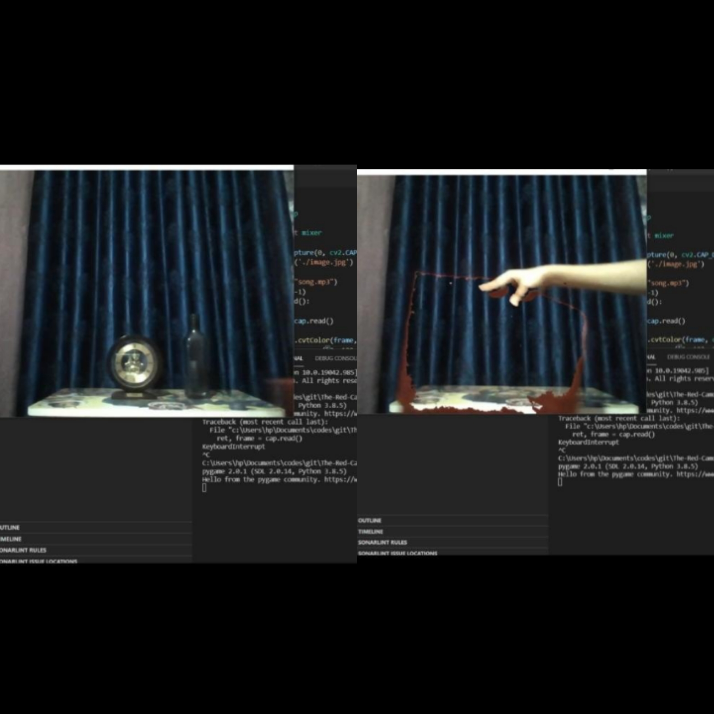

<!-- PROJECT LOGO -->

    
  </a>

  

    "The Red Camouflage Cape🦸"
      
    <a href="">Live Demo</a>
  

<!-- TABLE OF CONTENTS -->

## Table of Contents

- [About the Project](#about-the-project)
  - [Usage Guidelines](#usage-guidelines)
  - [Built With](#built-with)

<!-- ABOUT THE PROJECT -->

## About The Project

Inspired by <strong>The Invisibility Cloak of Harry Potter </strong>the project <strong>The Red Camouflaged Cape </strong> is built
 
The Cloak of invisibility is a magical artefact usead to render the wearer invisible.

<!-- Extensions Required -->
### Usage Guidelines.

  To use The Red Camouflage Cape, 
  -firstly run the file <strong>backgroundimg.py </strong>Press <strong>q </strong>to capture the image. This would click the image of the background and save it with the name <strong>image.jpg</strong>
  -Now run the file <strong>invisibilityCloak.py </strong>and see  the magic. You can hide yourself in the red cloth and enjoy the mesmerizing background music!!

### Built With
The project is built using basic Python code. 
The  various python modules used in project:
- OpenCV
- Numpy
- Pygame (for adding the background music)

